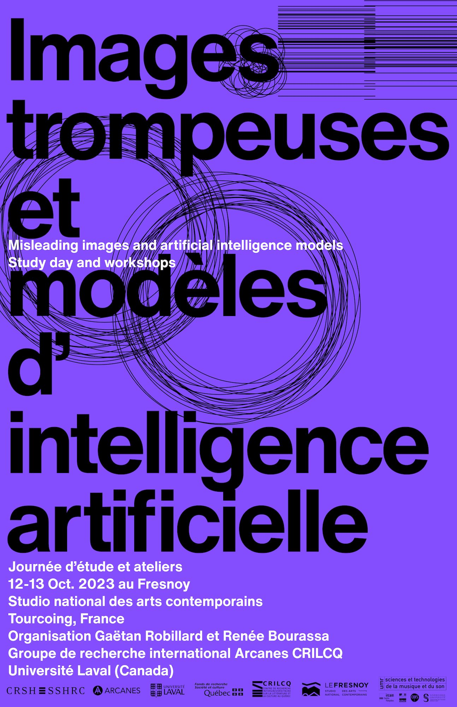

# Images trompeuses et modèles d'intelligence artificielle

Cycle journée d'étude et ateliers, les 12 et 13 octobre 2023 au Fresnoy, Studio national des arts contemporains

___Misleading Images and Artificial Intelligence Models___

_Study day and workshops, October 12 and 13 at Fresnoy, National studio of contemporary arts_

Voir programme (_see program_) [pdf](medias/programme.pdf)

## Résumés (_Abstracts_)

### 12 Octobre. Journée d'étude (_Study day_)

**Kazushi Mukaiyama (Online)**

"Mes lignes tracées par l'IA"

Dans le domaine de l’image, l’IA générative suscite aujourd’hui beaucoup d’attention. Depuis plus de vingt ans, Kazushi Mukaiyama développe un programme de peinture par IA car il cherchait à savoir pourquoi les humains produisent ou s’intéressent à l’art. Durant cette période, Shizuka – le peintre IA, a connu plusieurs changements. Tout d’abord, il ne pouvait dessiner qu’une seule image fixe à la fois, telle une scène. Ensuite, des tentatives ont été faites pour créer des séquences d’images continues à la manière d’un manga, telles des histoires. Dernièrement, le programme a dessiné des images à partir de lignes produites par Mukaiyama lui-même. Ce résultat lui permet désormais d'envisager son propre processus créatif d'une manière entièrement inédite. Ainsi, l’IA fournit des indices lui permettant de comprendre ce qui fonde la capacité des humains à créer de l’art. L’une de ces indications est que, parmi toutes les créatures sur terre, seuls les humains peuvent tracer du texte. Et cette possibilité semble être intimement liée à notre capacité de traiter de l’art. Mukaiyama a pu le vérifier en utilisant l'IA générative d’aujourd’hui appliquée aux images. En outre, la présentation abordera des points importants pour réfléchir sur l’avenir de ce domaine de recherche.

*"My lines drawn by AI"*

*Image-generative AI is getting a lot of attention right now. Kazushi Mukaiyama has been developing an AI painting program for over 20 years because he wanted to know why humans make or deal with art. During this time, Shizuka, the AI painter, has undergone various changes. First of all, it could only draw one still picture at a time, like a scene. Then, attempts were made to create continuous Manga-like sequences of images, like stories. Lately, the program drew images from lines directly produced by Mukaiyama. This result is now enabling him to consider his creative process in a deep novel way. Thus, AI is giving him hints to understand the way humans can make art. One of the hints is that, of all the creatures on earth, only humans can draw text. And this ability seems to be deeply related to our ability to deal with art. Mukaiyama has been able to verify this by using the current image-generative AI which he will talk about. In addition, the presentation will discuss what is needed for thinking about the future of image-generative AI.*

**Terence Broad**

"Intrusions astucieuses : guide du hacker sur l'IA générative"

Les modèles d’IA générative, bien que capables de produire des images convaincantes, occultent souvent leurs processus créatifs. Ils fournissent une forme illusoire de production médiatique, dans laquelle les mécanismes de formation sont obscurcis par des processus de boîte noire. Cette conférence présentera trois projets artistiques : Being Foiled, Teratome et Ghosts, tous nés d'une approche hacker de l'IA générative. Ces travaux sont le résultat de différentes interventions dans les phases d’entraînement et de génération de modèles d’IA, chacune offrant un aperçu unique du fonctionnement des processus génératifs à l’oeuvre.

*"Artful Intrusions—A Hacker's Guide to Generative AI"*

*Generative AI models, while capable of producing convincing images, often obscure their creative processes. They provide an illusory form of media production, where the mechanics of formation are obscured by black-box processes. This talk will introduce three artistic projects—Being Foiled, Teratome, and Ghosts—all born from a hacker's approach to generative AI. These works were the result of different interventions into the training and generation phases of AI models, each offering unique insights into the workings of generative processes.*

### 13 Octobre. Ateliers (_Workshops_)

## Biographies

## Ressources ateliers (_Workshops material_)

See mobilenet2gif folder for js code.

References for Stable diffusion webui colab [https://github.com/camenduru/stable-diffusion-webui-colab](https://github.com/camenduru/stable-diffusion-webui-colab)

Stable Diffusion web UI by AUTOMATIC 1111 [https://github.com/AUTOMATIC1111/stable-diffusion-webui](https://github.com/AUTOMATIC1111/stable-diffusion-webui)
